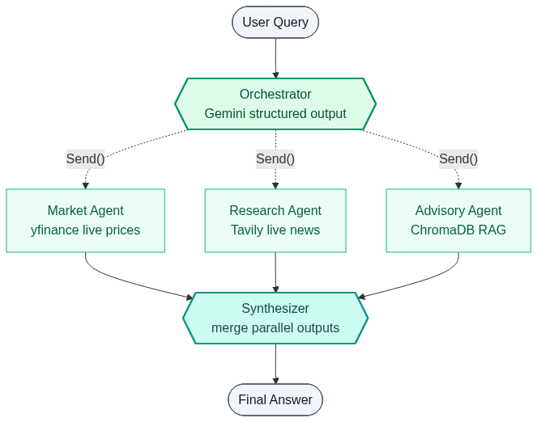

# Agentic Financial Assistant

A multi agent conversational AI for financial queries, built on LangGraph. An Orchestrator classifies every question and dispatches one or more specialized agents in parallel. A Synthesizer merges their outputs into a single coherent answer. Every piece of data is real: live stock prices, live web news, and a curated financial knowledge base.

**Live demo**: [huggingface.co/spaces/hirenpurabiya/agentic-financial-assistant](https://huggingface.co/spaces/hirenpurabiya/agentic-financial-assistant)

## Architecture



The Orchestrator can dispatch to zero, one, or multiple agents. When multiple agents run, LangGraph's `Send()` executes them in parallel and the Synthesizer merges the outputs. MemorySaver checkpoints keep conversation state per thread.

## Three specialized agents

| Agent | Tool | Data source | Example query |
|---|---|---|---|
| **Market** | `get_market_data` | yfinance (live) | "How is NVDA doing today?" |
| **Research** | `search_financial_news` | Tavily web search (live) | "Latest news on Tesla?" |
| **Advisory** | `search_knowledge_base` | ChromaDB RAG (16 curated entries) | "What is a Roth IRA?" |

For mixed queries like "How is AAPL performing and what is the latest news on it?", the Orchestrator dispatches the Market and Research agents in parallel and the Synthesizer combines the results.

## What it demonstrates

- Multi agent orchestration with LangGraph StateGraph
- Hierarchical delegation: Orchestrator routes to specialized agents
- Parallel execution via `Send()` for queries that need multiple agents
- RAG over a curated financial knowledge base with ChromaDB
- Tool calling: each agent decides which tools to use at runtime
- Structured output: Pydantic models for deterministic routing
- Conversation memory via MemorySaver checkpointing

## Stack

- **Orchestration**: LangGraph
- **LLM**: Google Gemini 2.5 Flash
- **Embeddings**: Google `gemini-embedding-001`
- **Vector store**: ChromaDB (in memory)
- **Market data**: yfinance
- **Web search**: Tavily
- **UI**: Gradio 6.x on Hugging Face Spaces

The architecture is model agnostic. Swap the LLM and embedding wrappers in `src/config.py` to use OpenAI, Anthropic, or AWS Bedrock with a one line change.

## File structure

```
agentic-financial-assistant/
├── src/
│   ├── config.py         # LLM, embeddings, logger, API key validation
│   ├── state.py          # TypedDict state + Pydantic models
│   ├── data.py           # 16 entry financial education corpus
│   ├── rag.py            # ChromaDB vector store setup
│   ├── tools.py          # get_market_data, search_financial_news, search_knowledge_base
│   ├── nodes.py          # Orchestrator + 3 agents + Synthesizer
│   ├── graph.py          # StateGraph wiring with MemorySaver
│   └── main.py           # CLI entry point
├── app.py                # Gradio UI for HF Spaces
├── requirements.txt
├── .env.example
└── README.md
```

## Run locally

```bash
git clone https://github.com/hirenpurabiya/agentic-financial-assistant.git
cd agentic-financial-assistant

python3 -m venv venv
source venv/bin/activate
pip install -r requirements.txt

cp .env.example .env
# Add your GOOGLE_API_KEY and TAVILY_API_KEY to .env

# CLI
python -m src.main

# Or single query
python -m src.main --query "How is AAPL doing today?"

# Or the Gradio UI
python app.py
```

## Disclaimer

Educational information only. Not personalized financial advice.

## Author

Built by [Hiren Purabiya](https://hirenpurabiya.github.io/ai-portfolio/). Part of an AI engineering portfolio. See the full set of projects at [hirenpurabiya.github.io/ai-portfolio](https://hirenpurabiya.github.io/ai-portfolio/).
